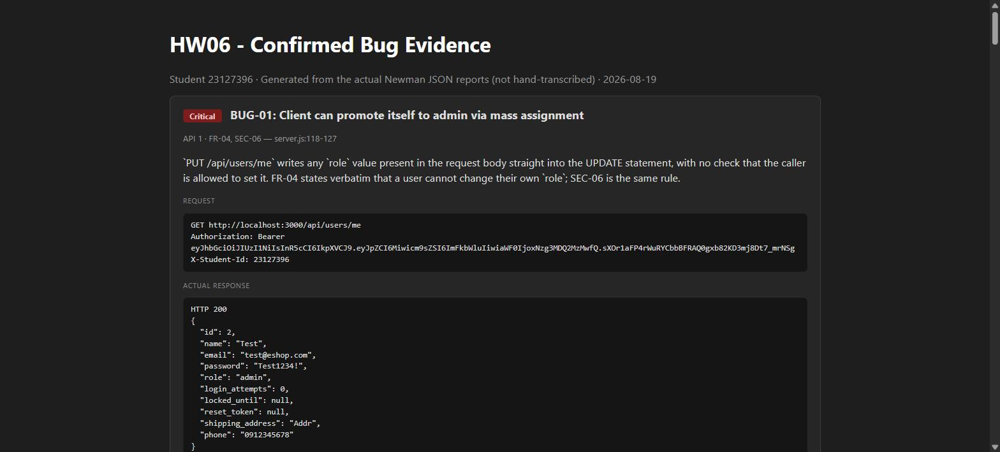
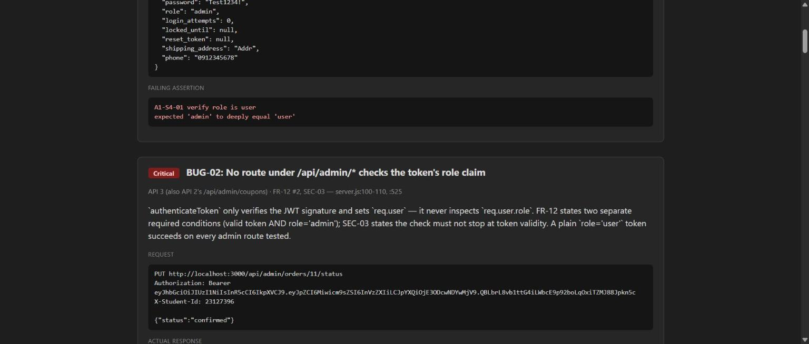
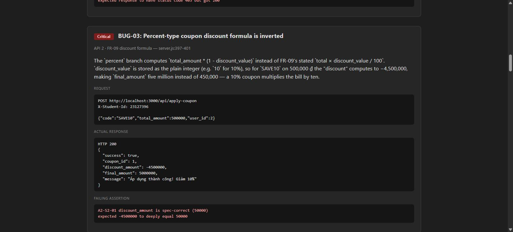
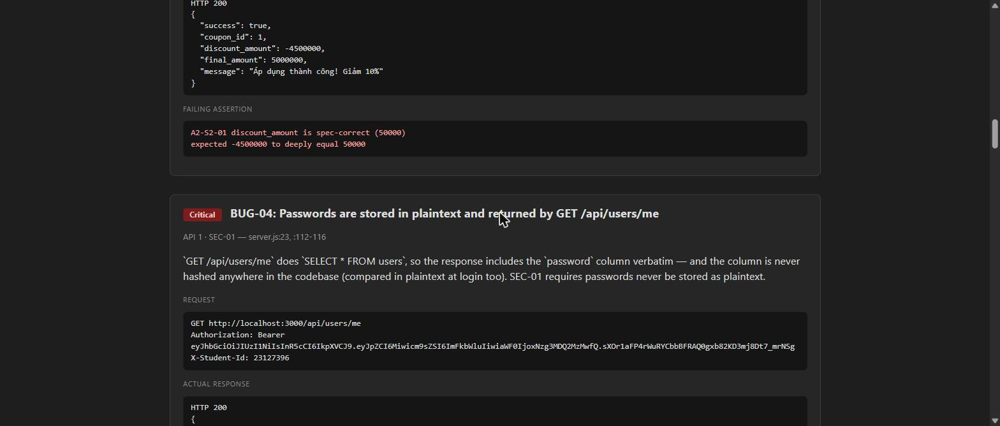
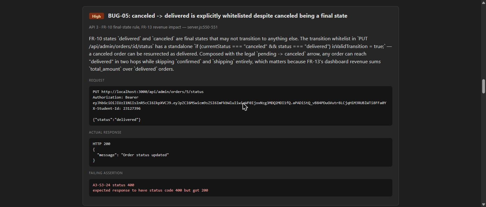
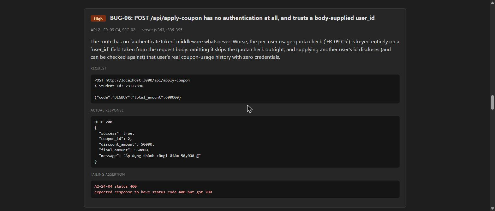
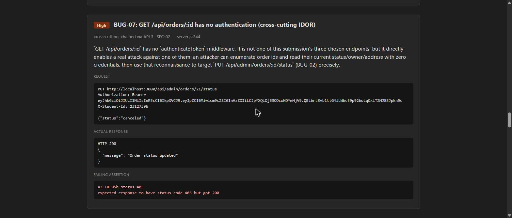
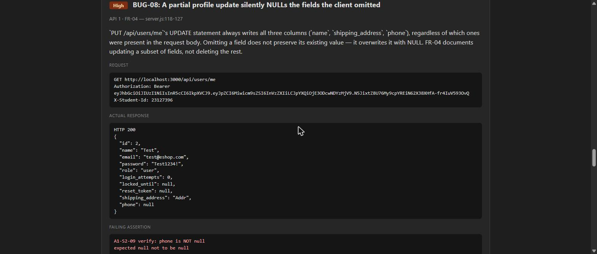
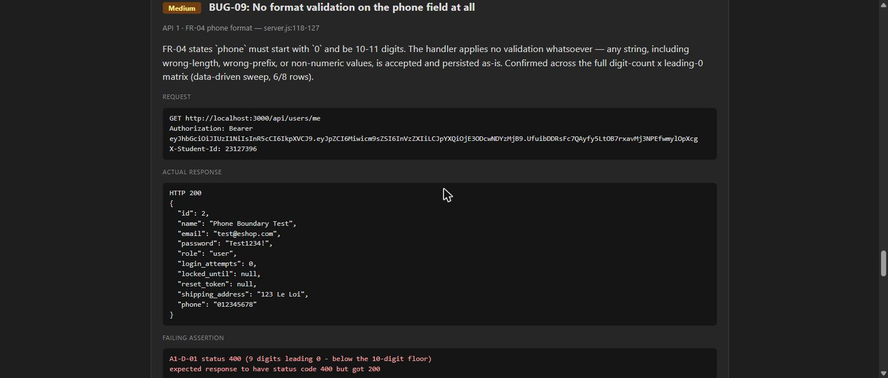
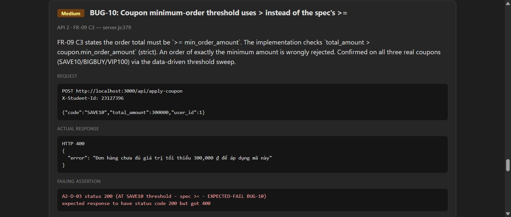

# HW06 — Bug Report

**Student:** 23127396 · **Repo:** [linhkhoi1309/eshop-sut-hw06-api](https://github.com/linhkhoi1309/eshop-sut-hw06-api)
**Scope:** confirmed defects found while testing the three chosen endpoints — `PUT /api/users/me`
(API 1), `POST /api/apply-coupon` (API 2), `PUT /api/admin/orders/:id/status` (API 3) — plus two
cross-cutting endpoints (`GET /api/orders/:id`, `/api/admin/coupons`) directly exploited while
chaining findings across them. Every entry below was reproduced live via the committed Postman
collections and Newman reports; none is a guess. Full technical detail, spec citations, and the
audit trail for each is in `docs/api*/audit.md` and `docs/api*/extended.md`.

Each row's **Evidence** links to a GitHub Issue (source of truth) and, where captured, a screenshot
of the exact failing/demonstrating assertion pulled from the actual Newman JSON report.

| ID | Title | Severity | API | Issue |
|---|---|---|---|---|
| BUG-01 | Client can promote itself to admin via mass assignment | Critical | API 1 | [#1](https://github.com/linhkhoi1309/eshop-sut-hw06-api/issues/1) |
| BUG-02 | No route under `/api/admin/*` checks the token's role claim | Critical | API 3 (+ API 2 admin) | [#2](https://github.com/linhkhoi1309/eshop-sut-hw06-api/issues/2) |
| BUG-01+02 | A brand-new account reaches full admin order control in two requests | Critical (composed) | API 1 → API 3 | [#3](https://github.com/linhkhoi1309/eshop-sut-hw06-api/issues/3) |
| BUG-03 | Percent-type coupon discount formula is inverted | Critical | API 2 | [#4](https://github.com/linhkhoi1309/eshop-sut-hw06-api/issues/4) |
| BUG-04 | Passwords stored in plaintext, exposed by GET /api/users/me | Critical | API 1 | [#5](https://github.com/linhkhoi1309/eshop-sut-hw06-api/issues/5) |
| BUG-05 | `canceled -> delivered` explicitly whitelisted despite being a final state | High | API 3 | [#6](https://github.com/linhkhoi1309/eshop-sut-hw06-api/issues/6) |
| BUG-06 | `apply-coupon` has no authentication and trusts a body-supplied `user_id` | High | API 2 | [#7](https://github.com/linhkhoi1309/eshop-sut-hw06-api/issues/7) |
| BUG-07 | `GET /api/orders/:id` has no authentication (cross-cutting IDOR) | High | cross-cutting | [#8](https://github.com/linhkhoi1309/eshop-sut-hw06-api/issues/8) |
| BUG-08 | A partial profile update silently NULLs omitted fields | High | API 1 | [#9](https://github.com/linhkhoi1309/eshop-sut-hw06-api/issues/9) |
| BUG-09 | No format validation on the phone field at all | Medium | API 1 | [#10](https://github.com/linhkhoi1309/eshop-sut-hw06-api/issues/10) |
| BUG-10 | Coupon threshold uses `>` instead of the spec's `>=` | Medium | API 2 | [#11](https://github.com/linhkhoi1309/eshop-sut-hw06-api/issues/11) |
| candidate | `apply-coupon`'s usage check is bypassable without ever calling `/api/coupon-usage` | Medium | API 2 | [#12](https://github.com/linhkhoi1309/eshop-sut-hw06-api/issues/12) |
| candidate | Admin cannot cancel a shipping order, despite FR-10's stated exception | Medium | API 3 | [#13](https://github.com/linhkhoi1309/eshop-sut-hw06-api/issues/13) |
| candidate | Deleting and recreating a coupon resets every user's quota | Low | API 2 | [#14](https://github.com/linhkhoi1309/eshop-sut-hw06-api/issues/14) |
| candidate | A coupon expires from the start of its expiry date, not the end | Low | API 2 | [#15](https://github.com/linhkhoi1309/eshop-sut-hw06-api/issues/15) |
| candidate | User-supplied `status` is reflected unescaped into the error message | Low | API 3 | [#16](https://github.com/linhkhoi1309/eshop-sut-hw06-api/issues/16) |

_Issue numbers above are filled in as each is filed; see the individual issue bodies for full
reproduction steps, request/response evidence, and spec citations._

---

## BUG-01 — Client can promote itself to admin via mass assignment

**Severity:** Critical · **API:** 1 (`PUT /api/users/me`) · **Spec:** FR-04, SEC-06 · `server.js:118-127`

`PUT /api/users/me` appends `role = ?` to its UPDATE statement whenever the request body contains a
`role` field, with no check that the caller is allowed to set it. FR-04 states verbatim that a user
cannot change their own `role`.

**Reproduction:**
```
PUT /api/users/me
Authorization: Bearer <user token>
{"name":"Test","shipping_address":"Addr","phone":"0912345678","role":"admin"}
```
Followed by `GET /api/users/me` → `role` is now `"admin"`.



---

## BUG-02 — No route under /api/admin/* checks the token's role claim

**Severity:** Critical · **API:** 3 (`PUT /api/admin/orders/:id/status`), confirmed additionally on
`POST /api/admin/coupons` (API 2) · **Spec:** FR-12 #2, SEC-03 · `server.js:100-110`, `:525`

`authenticateToken` only verifies the JWT signature and sets `req.user` — it never inspects
`req.user.role`. FR-12 states two separate required conditions (valid token **and** `role='admin'`);
SEC-03 states the check must not stop at token validity.

**Reproduction:**
```
PUT /api/admin/orders/11/status
Authorization: Bearer <role='user' token>
{"status":"confirmed"}
```
Expected 403, got 200.



---

## BUG-01+02 — A brand-new account reaches full admin order control in two requests

**Severity:** Critical (composed) · **API:** 1 → 3 · **Spec:** FR-12, SEC-03, SEC-06

BUG-01 lets any account claim `role: admin` on itself; BUG-02 means the admin order-status route
never checks that claim (or any role at all) in the first place — the escalation step is not even
required. A never-escalated, two-minute-old account can single-handedly drive any order from
`pending` to `delivered`.

**Reproduction:** register a throwaway account, log in, then with no prior escalation step:
```
PUT /api/admin/orders/18/status
Authorization: Bearer <throwaway account token>
{"status":"confirmed"}
```
```json
HTTP 200
{ "message": "Order status updated" }
```
Expected 403 (`A3-EX-01c status 403` — `expected response to have status code 403 but got 200`).
Repeating with `{"status":"shipping"}` then `{"status":"delivered"}` on the same order succeeds too —
the account never touched the role-escalation endpoint at all.

---

## BUG-03 — Percent-type coupon discount formula is inverted

**Severity:** Critical · **API:** 2 (`POST /api/apply-coupon`) · **Spec:** FR-09 discount formula ·
`server.js:397-401`

The `percent` branch computes `total_amount * (1 - discount_value)` instead of FR-09's stated
`total × discount_value / 100`. `discount_value` is stored as the plain integer (`10` for 10%), so
for `SAVE10` on 500,000 ₫ the "discount" computes to −4,500,000 — `final_amount` becomes 5,000,000
instead of 450,000. A 10% coupon multiplies the bill by ten.

**Reproduction:**
```
POST /api/apply-coupon
{"code":"SAVE10","total_amount":500000,"user_id":2}
```
```json
HTTP 200
{ "success": true, "coupon_id": 1, "discount_amount": -4500000, "final_amount": 5000000, ... }
```



---

## BUG-04 — Passwords stored in plaintext, exposed by GET /api/users/me

**Severity:** Critical · **API:** 1 · **Spec:** SEC-01 · `server.js:23`, `:112-116`

`GET /api/users/me` does `SELECT * FROM users`, returning the `password` column verbatim — and the
column is never hashed anywhere in the codebase (compared in plaintext at login too).

**Reproduction:** `GET /api/users/me` with a valid token → response body includes
`"password": "Test1234!"`.



---

## BUG-05 — canceled -> delivered explicitly whitelisted despite canceled being a final state

**Severity:** High · **API:** 3 · **Spec:** FR-10 final-state rule, FR-13 revenue impact ·
`server.js:550-551`

FR-10 states `delivered` and `canceled` are final states that may not transition to anything else.
The transition whitelist has a standalone `if (currentStatus === "canceled" && status === "delivered")
isValidTransition = true;`. Composed with the legal `pending -> canceled` arrow, any order can reach
"delivered" in two hops while skipping `confirmed` and `shipping` entirely — which matters because
FR-13's dashboard revenue sums `total_amount` over `delivered` orders.

**Reproduction:**
```
PUT /api/admin/orders/5/status     {"status":"delivered"}   (order currently canceled)
```
```json
HTTP 200
{ "message": "Order status updated" }
```
Expected 400 (`A3-S3-24 status 400` — `expected response to have status code 400 but got 200`).



---

## BUG-06 — apply-coupon has no authentication at all, and trusts a body-supplied user_id

**Severity:** High · **API:** 2 · **Spec:** FR-09 C4, SEC-02 · `server.js:363`, `:386-395`

The route has no `authenticateToken` middleware whatsoever. The per-user usage-quota check (FR-09
C5) is keyed entirely on a `user_id` field taken from the request body: omitting it skips the quota
check outright, and supplying another user's id discloses that user's real coupon-usage history with
zero credentials.

**Reproduction:** no `Authorization` header at all —
```
POST /api/apply-coupon
{"code":"BIGBUY","total_amount":600000}
```
Succeeds (200) with the quota check skipped entirely.



---

## BUG-07 — GET /api/orders/:id has no authentication (cross-cutting IDOR)

**Severity:** High · **API:** cross-cutting, chained via API 3 · **Spec:** SEC-02 · `server.js:344`

Not one of this submission's three chosen endpoints, but it directly enables a real attack against
one of them: an attacker can enumerate order ids and read their current status/owner/address with
zero credentials, then target `PUT /api/admin/orders/:id/status` (BUG-02) precisely instead of
blindly.

**Reproduction:** `GET /api/orders/6` with no `Authorization` header → 200, full order detail
(owner's `shipping_address`, `status`, `total_amount`) returned. Then, still with zero credentials
beyond a plain `role='user'` token: `PUT /api/admin/orders/6/status {"status":"canceled"}` → 200,
the victim's order silently canceled.



---

## BUG-08 — A partial profile update silently NULLs the fields the client omitted

**Severity:** High · **API:** 1 · **Spec:** FR-04 · `server.js:118-127`

The UPDATE statement always writes all three columns (`name`, `shipping_address`, `phone`),
regardless of which ones were present in the request body. Omitting a field does not preserve its
existing value — it overwrites it with NULL.

**Reproduction:** with a fully-populated profile, `PUT /api/users/me {"name":"X"}` (omitting
`shipping_address`/`phone`), then `GET /api/users/me` → both omitted fields are now `null`.



---

## BUG-09 — No format validation on the phone field at all

**Severity:** Medium · **API:** 1 · **Spec:** FR-04 phone format · `server.js:118-127`

FR-04 states `phone` must start with `0` and be 10-11 digits. The handler applies no validation
whatsoever. Confirmed across the full digit-count × leading-0 matrix (data-driven sweep, 6/8 rows
fail against spec).

**Reproduction:** `PUT /api/users/me {"phone":"012345678"}` (9 digits) → 200, persisted as-is.



---

## BUG-10 — Coupon minimum-order threshold uses > instead of the spec's >=

**Severity:** Medium · **API:** 2 · **Spec:** FR-09 C3 · `server.js:379`

FR-09 C3 states the order total must be `>= min_order_amount`. The implementation checks strict `>`.
An order of exactly the minimum amount is wrongly rejected. Confirmed on all three real coupons
(SAVE10/BIGBUY/VIP100) via the data-driven threshold sweep.

**Reproduction:** `POST /api/apply-coupon {"code":"SAVE10","total_amount":300000,"user_id":1}`
(exactly the 300,000 ₫ minimum) → 400 `"Đơn hàng chưa đủ giá trị tối thiểu..."`. Expected 200.



---

## Candidate — apply-coupon's usage check is bypassable without ever calling POST /api/coupon-usage

**Severity:** Medium (candidate) · **API:** 2 · **Spec:** FR-09 C5 (practical guarantee) ·
`server.js:362-441` vs `:443-451`

`POST /api/apply-coupon` never writes to `coupon_usage` — it only reads the count. The only endpoint
that records a use is the separate, authenticated `POST /api/coupon-usage`. A client that simply
never calls it can "successfully apply" a single-use coupon an unlimited number of times, since the
per-use check only ever runs against usage the client itself chose to record.

**Reproduction:** `POST /api/apply-coupon {"code":"SAVE10","total_amount":500000,"user_id":2}` twice
in a row, with no `POST /api/coupon-usage` call in between → both return 200.

---

## Candidate — Admin cannot cancel a shipping order, despite FR-10's stated exception

**Severity:** Medium (candidate) · **API:** 3 · **Spec:** FR-10 shipping-cancel exception ·
`server.js:537-551` (entry absent)

FR-10 says only Admin (not User) may cancel a `shipping` order. The transition whitelist has no
`shipping -> canceled` entry at all — every admin attempt to cancel a shipping order is rejected,
contradicting the spec's own stated exception.

**Reproduction:**
```
PUT /api/admin/orders/8/status   {"status":"canceled"}   (order currently shipping)
```
```json
HTTP 400
{ "error": "Invalid state transition from shipping to canceled" }
```
Expected 200 (`A3-S3-15 status 200` — `expected response to have status code 200 but got 400`).

---

## Candidate — Deleting and recreating a coupon with the same code resets every user's quota

**Severity:** Low (candidate) · **API:** 2 · **Spec:** schema/identity gap, no direct FR ·
`database.js:29-38`, `server.js:388`

`coupon_usage.coupon_id` references the coupon table's internal autoincrement `id`, not its `code`.
There is no update-coupon endpoint, so an admin fixing a typo has to delete and recreate the coupon —
silently resetting every user's usage count for that code, since the new row gets a new `id`.

**Reproduction:** exhaust a user's `SAVE10` quota (apply + record) → `DELETE
/api/admin/coupons/:id` then `POST /api/admin/coupons` recreating `SAVE10` with identical fields →
the same user can immediately apply `SAVE10` again (200), despite having already used their one
allowed use.

---

## Candidate — A coupon expires from the start of its expiry date, not the end

**Severity:** Low (candidate) · **API:** 2 · **Spec:** FR-09 C2, `Date`-parsing default ·
`server.js:381-384`

`new Date(coupon.expired_at)` parses a date-only string as midnight. The expiry check (`expiry <
now`) then rejects the coupon for the entire calendar day it expires on, not just the day after — one
full day earlier than the common e-commerce reading of "valid through this date."

**Reproduction:** a coupon with `expired_at` set to today's date, applied any time after 00:00 local:
```
POST /api/apply-coupon {"code":"EXPIRETODAY","total_amount":500000,"user_id":2}
```
```json
HTTP 400
{ "error": "Mã giảm giá đã hết hạn" }
```
Whether this is spec-correct or spec-silent is itself debatable — flagged as a candidate, not an
`EXPECTED-FAIL`, in `docs/api2-apply-coupon/extended.md`.

---

## Candidate — User-supplied status is reflected unescaped into the error message

**Severity:** Low (candidate) · **API:** 3 · **Spec:** SEC-04 (output-encoding intent) ·
`server.js:554-556`

The illegal-transition error message interpolates the raw request `status` value directly:
`` `Invalid state transition from ${currentStatus} to ${status}` ``. Not a SQL-injection risk (the
value never reaches a query unparameterised), but any consumer that renders this message without
escaping inherits an XSS surface.

**Reproduction:**
```
PUT /api/admin/orders/4/status   {"status":"<script>alert(document.cookie)</script>"}
```
```json
HTTP 400
{ "error": "Invalid state transition from delivered to <script>alert(document.cookie)</script>" }
```

---

## Not bugs — tested and passed

Documented so silently-dropped cases don't read as unconsidered:

- **Email immutability** (API 1) — `email` in the request body is correctly ignored; FR-04's rule holds.
- **SQL injection** — all three chosen endpoints use parameterized queries; injection payloads on
  `phone`, `code`, and `status` are all correctly rejected as ordinary invalid values, never as SQL.
- **Mass-update scoping** (API 3) — `UPDATE orders SET status = ? WHERE id = ?` never affects a
  second order.
- **Cross-user admin reach** (API 3) — Admin can legitimately manage any user's order, per FR-18.
- **`/api/coupon-usage` identity scoping** (API 2) — correctly uses the token's own `req.user.id`,
  ignoring any spoofed `user_id` in the body.
