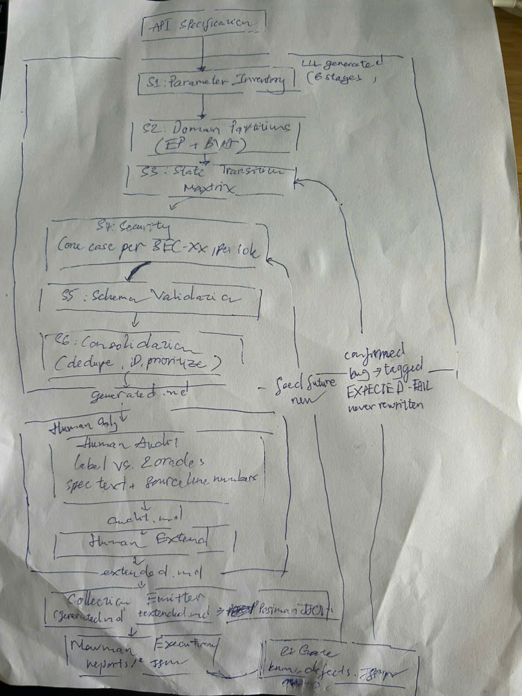
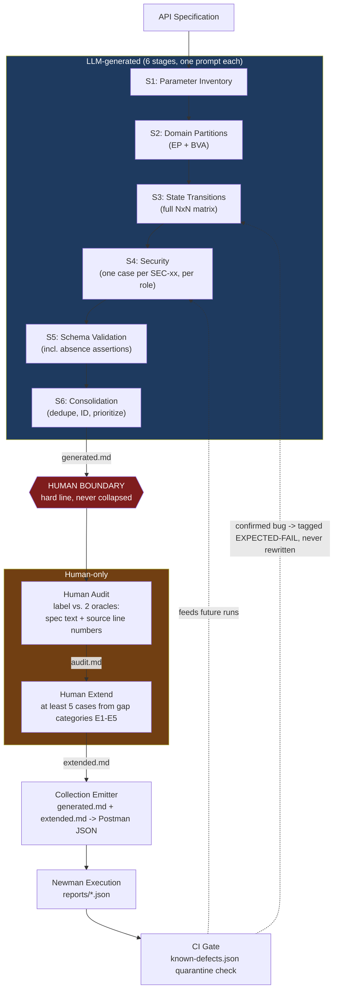

# AI-Driven API Test Generator — Design

**Student:** 23127396 · **Requirement:** §7 (Create/G9.5), §11 (anti-AI-cheat)

> **On the diagram:** `evidence/generator-diagram.jpg` is hand-drawn by the student — §11 requires
> this explicitly and TAs verify it. The pseudocode below (`generator.py`) is AI-assisted, which is
> declared in the AI Audit Report — only the diagram carries the "not AI-generated" constraint, and
> only the diagram below satisfies it (the Mermaid rendering further down this file is an AI-drawn
> reference sketch and does not).



*Drawn after API 3 was complete, per `PLAN.md`'s ordering constraint ("describes the pipeline
actually used, not an idealised one"): API Specification → the six LLM-generated stages (S1–S6,
boxed together as "LLM generated") → Human Audit → Human Extend → Collection Emitter → Newman
Execution → CI Gate, with the feedback arrow back into S3/S4 labelled "confirmed bug → tagged
EXPECTED-FAIL, never rewritten."*

## What this generator is

Not a novel tool built for this write-up — a formalization of the exact process
`skills/api-testcase-generator`, `skills/api-testcase-audit`, and the collection-building step ran
by hand for API 1, 2, and 3 in this repo. The design decision this document documents is: **why
one generic "generate all test cases" prompt fails, and why six narrow, ordered, spec-anchored
prompts don't** — a decision validated empirically three times over (`docs/api1-users-me/`,
`docs/api2-apply-coupon/`, `docs/api3-admin-order-status/`), not assumed up front.

## Architecture — what the diagram depicts

Six boxes in a pipeline, each stage's output feeding the next (not six independent calls to the
same prompt), followed by two human-only boxes, then an emission/execution box, with one feedback
arrow back into the CI gate. Same structure as the hand-drawn diagram above, spelled out in text:

```
[API Specification]
        |
        v
[S1: Parameter Inventory]  --(param table)-->
        |
        v
[S2: Domain Partitions]  --(partition/boundary cases)-->
        |
        v
[S3: State Transitions]  --(full NxN transition matrix)-->
        |
        v
[S4: Security]  --(one case per SEC-xx, per role)-->
        |
        v
[S5: Schema Validation]  --(success/error shape + absence assertions)-->
        |
        v
[S6: Consolidation]  --(deduped, ID'd, prioritised generated.md)-->
        |
        v
========================= human boundary =========================
        |
        v
[Human Audit: label vs. 2 oracles (spec text + source line numbers)] --(audit.md)-->
        |
        v
[Human Extend: >=5 cases from gap categories E1-E5] --(extended.md)-->
        |
        v
[Collection Emitter: generated.md + extended.md -> Postman JSON]
        |
        v
[Newman Execution] --(reports/*.json, known failures tagged EXPECTED-FAIL)-->
        |
        v
[CI Gate: postman/known-defects.json quarantine check] ---feedback arrow back into---> [S3/S4 next run:
                                                                                          confirmed bugs
                                                                                          inform future
                                                                                          EXPECTED-FAIL tags]
```

> **This Mermaid rendering is an AI-drawn reference sketch for the student to study while hand-drawing
> `evidence/generator-diagram.png` — it does NOT satisfy Requirement §7/§11 itself, regardless of
> Mermaid being an accepted *format* per §14's "PNG / Mermaid" wording. §11 requires the diagram to be
> self-drawn — the student makes the design decisions and produces it; format flexibility doesn't
> change who has to author it. Do not export, trace, or paste this block in as the submitted diagram.**



Two design decisions worth drawing attention to (literally, as callouts on the diagram):

1. **The human boundary is a hard line, not a dashed one.** Everything above it is LLM-generated;
   everything below it — labeling, correction, and the five human-added cases — must be human
   judgment against the two named oracles. Collapsing this line (e.g., having the LLM "audit itself")
   is exactly the failure mode `PLAN.md` warns against turning the suite green by construction.
2. **The feedback arrow is the reason `postman/known-defects.json` exists.** A generated case that
   turns out to target a confirmed defect doesn't get its expectation rewritten (that deletes the
   finding) — it gets tagged, and the tag feeds the CI quarantine gate on every subsequent run.

## Why six stages, not one

| Failure mode of a single "generate all test cases" prompt | How splitting into 6 stages fixes it |
|---|---|
| Clusters on the happy path and missing-required-field cases (training-distribution density) | Each stage has a narrow, exhaustive target (e.g. S2 must cover every parameter's valid+invalid class) that a single broad prompt has no mechanism to guarantee |
| Never systematically walks a state machine | S3 is prompted specifically for the *complement* of the drawn diagram — illegal transitions and transitions out of final states — which a model reading a forward-drawn diagram will not produce unless asked for what's *absent* |
| Folds "has a token" into "has the right role" | S4 is prompted per SEC-xx requirement *and* per role, forcing authentication and authorization into separate cases |
| Never asserts a field's *absence* | S5 explicitly asks for what must NOT be in the response, which is not a natural completion of "what does the response contain" |
| Guesses at conventional REST behaviour for an unspecified case | Every stage's prompt template carries two invariant rules (below) that forbid guessing |

## The two invariant rules (every stage prompt carries both)

1. **If the spec does not determine the expected result, output `UNDETERMINED` and say what's
   missing.** Never guess. This is what makes the audit step possible — an `UNDETERMINED` case has a
   stated reason to resolve; a guessed one doesn't.
2. **Do not infer behaviour from how such APIs "usually" work.** A deliberately-defective SUT does not
   have conventional behaviour by definition; asserting the conventional case guarantees the test
   passes against a bug.

## Numbering and traceability

`<API-id>-<stage>-<nn>`, e.g. `A2-S3-05`. The stage stays visible through the audit table, the
extension table, and the Postman collection's folder structure, so a reviewer can see at a glance
whether a stage was thin (e.g. six S2 cases next to thirty S4 cases signals S2 was under-driven)
without re-deriving coverage from scratch.

## What `generator.py` is (and isn't)

Pseudocode for the six-stage orchestration loop plus the consolidation/emission steps — the
`call_llm(...)` calls are stubs, not a working integration, since the actual six stages in this
submission were run interactively (one prompt per stage, human-reviewed before advancing) rather
than as an unattended batch job. The file exists to make the *algorithm* concrete and reviewable,
matching the "pseudocode" deliverable in §7, not to be a deployable tool.
